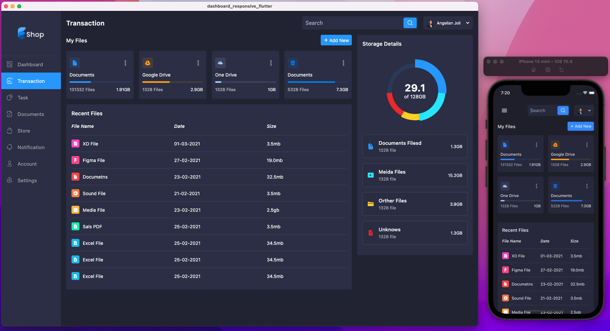
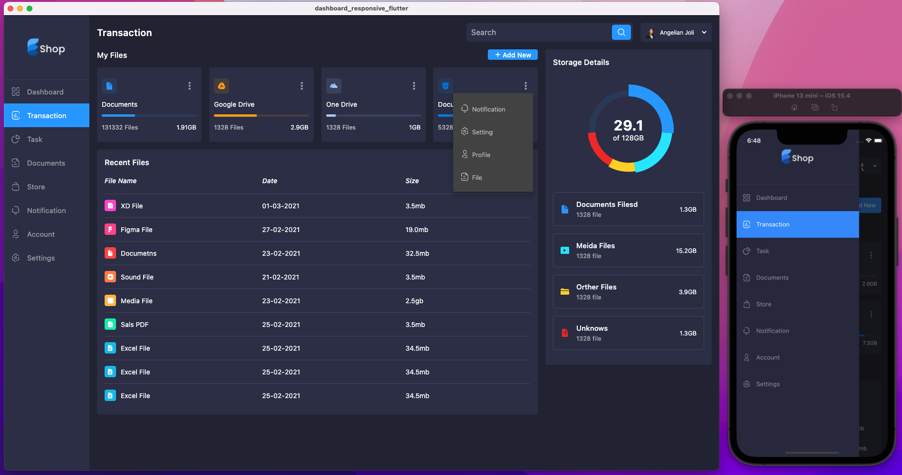
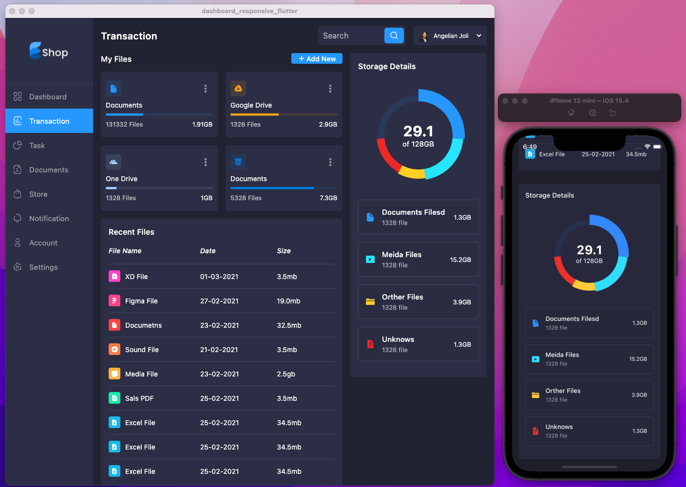
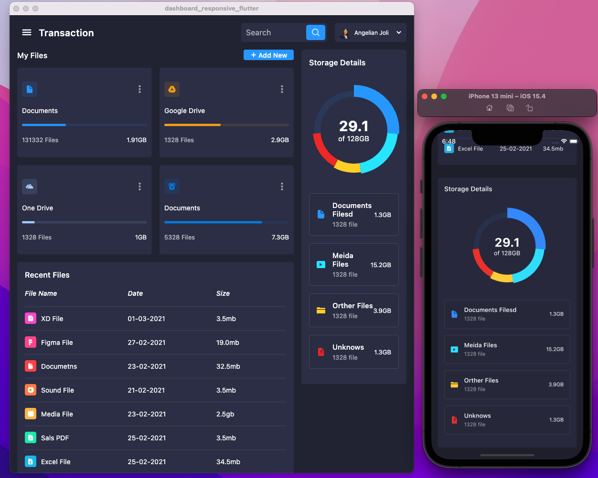

# dashboard_responsive_flutter

A Flutter project for Admin Dashboard to up skill responsive app.

- Coder: Pt Nguyen

- Gihub: [Link](https://github.com/coderThanh)

## Description

Packeged using in app:

- cupertino_icons: ^1.0.2
- flutter_svg: ^1.1.1+1
- fl_chart: ^0.55.1

Images demo:

Large Desktop / mobile

Large Desktop / mobile drawer

Desktop / mobile

Tablet / Mobile

A few resources to get you started

- [Youtube code tutorial](https://www.youtube.com/watch?v=kmZz_q7W2jI)
- [Source code sample start](https://github.com/abuanwar072/Flutter-Responsive-UI)
